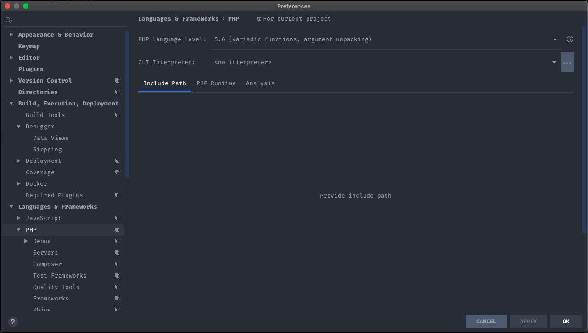
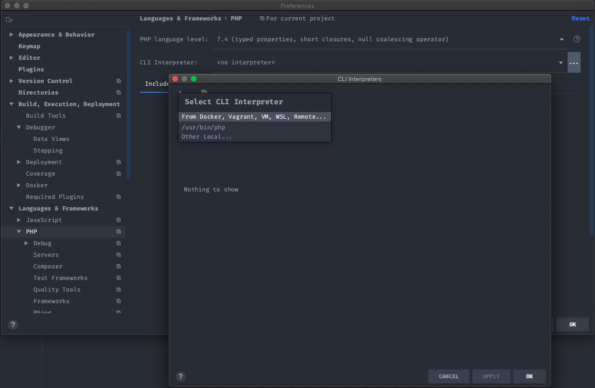
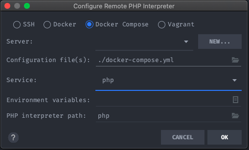
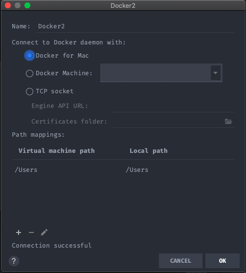
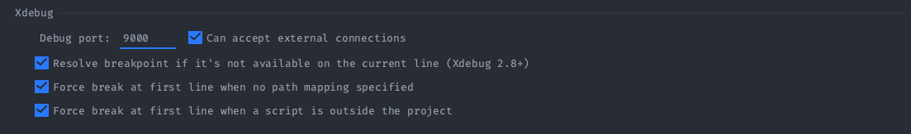
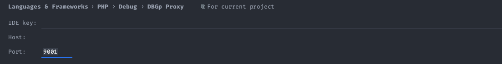
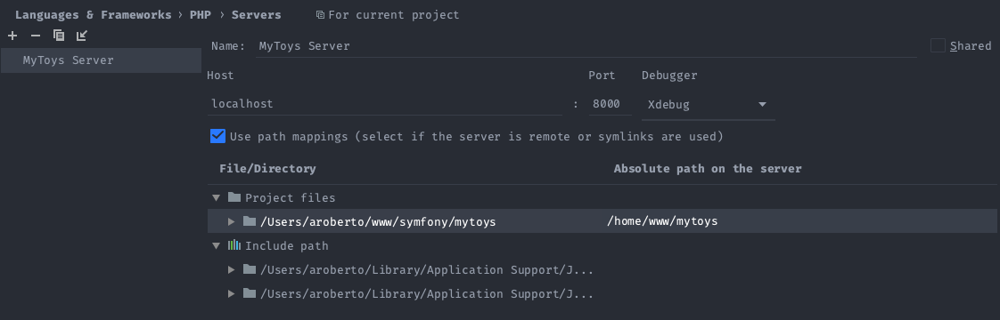
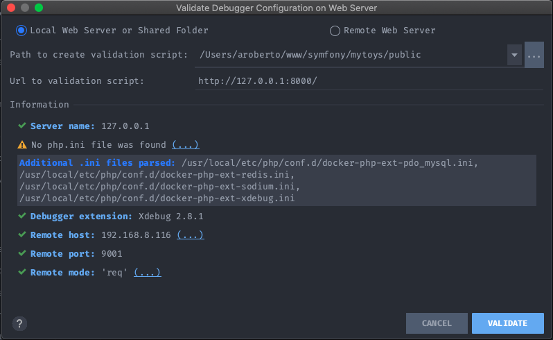

# MyToys FrontEnd Environment

##### Requirements

* Vagrant or Docker 

##### Features
1. PHP 7.4
2. Node 10
3. Apache 2.4
4. AWS Client 
5. Terraform

##### For Vagrant

```
vagrant up
```

##### For Docker

1. Rename .env.dist for .env;
2. On ./docker/php rename Dockerfile.dist to Dockerfile;
3. On the php Dockerfile, replace LOCAL_IP_ADDRESS to your current ip address;

```
docker-compose up
```

##### Configure you PHPStorm

1. PHPStorm > Preferences > Languages & Frameworks > PHP -> is mandatory select the PHP installed on the container as an interpreter for your project:




2. PHPStorm > Preferences > Languages & Frameworks > PHP > Debug -> update Debug port to 9001 instead 9000

3. PHPStorm > Preferences > Languages & Frameworks > PHP > Debug > DBGp Proxy -> specify the IDE Key as www-data and Host as your current ip address

4. PHPStorm > Preferences > Languages & Frameworks > PHP > Server -> Configure the host as localhost, port as 8000 (docker-compose for apache port), select the option Include Path and specify the apache folder where the project is (/home/www/mytoys)
 
5. PHPStorm > Preferences > Languages & Frameworks > PHP > Debug -> to validate your configuration click on the option validate and specify the entry point of the application for symfony (Path to create validation script)


